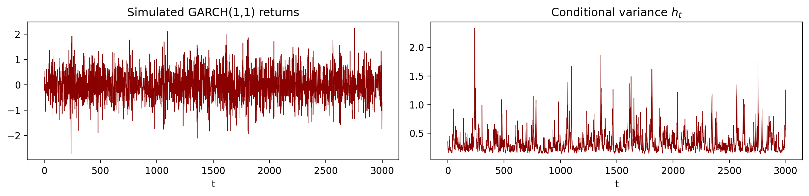
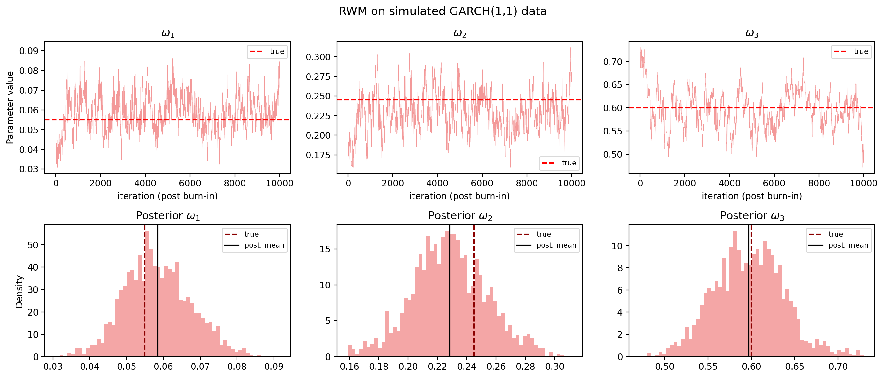
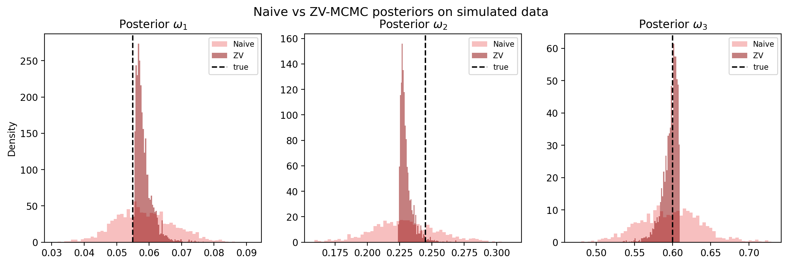
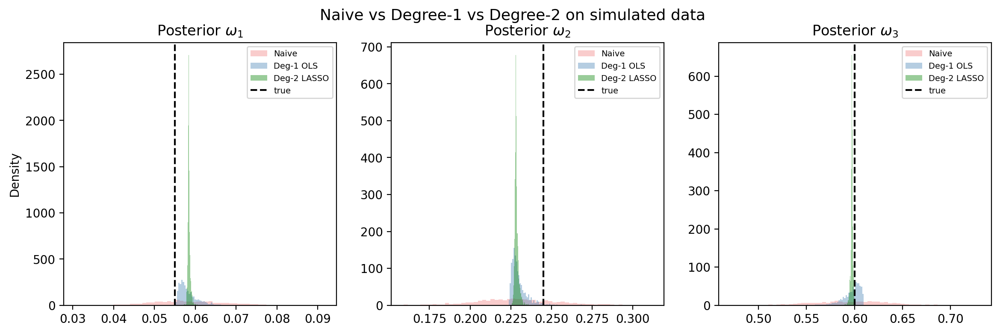
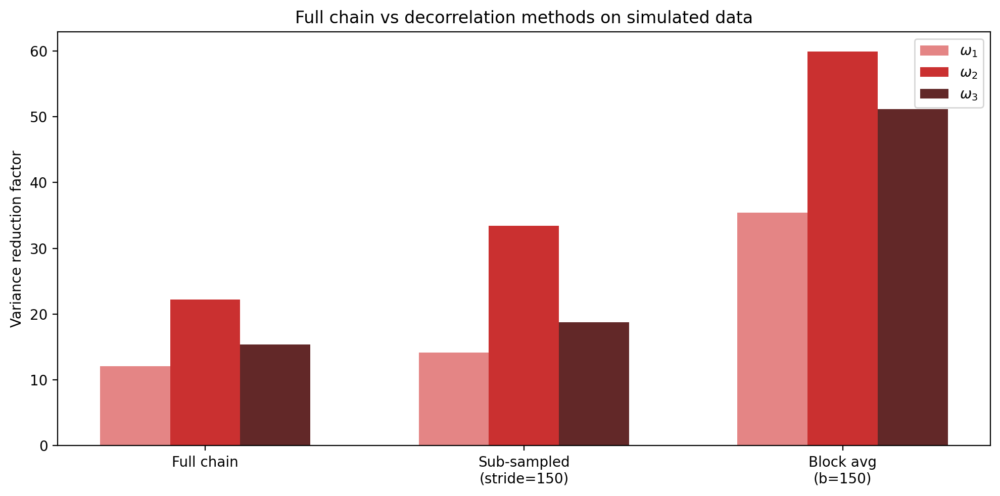

# Control Variates for a GARCH Model

> Variance reduction in Bayesian MCMC estimation of a GARCH(1,1) model via Zero-Variance control variates.

---

## Overview

This project implements and evaluates **Zero-Variance (ZV) control variates** to improve the efficiency of Markov Chain Monte Carlo (MCMC) posterior estimation in a GARCH(1,1) model. Starting from a standard Random Walk Metropolis sampler, we progressively apply variance reduction techniques — from a degree-1 OLS estimator up to a degree-2 LASSO estimator — and study the effect of MCMC autocorrelation on the regression.

The implementation follows two reference papers:

- **Mira, Solgi & Imparato (2013)** — *Zero variance Markov chain Monte Carlo for Bayesian estimators*, Stat Comput 23:653–662. [DOI](https://doi.org/10.1007/s11222-012-9344-6)
- **Leluc, Portier & Segers (2021)** — *Control variate selection for Monte Carlo integration*, Stat Comput 31:50. [DOI](https://doi.org/10.1007/s11222-021-10011-z)

---

## Model

The Normal-GARCH(1,1) model (Bollerslev 1986) is defined as:

$$r_t \mid \mathcal{F}_{t-1} \sim \mathcal{N}(0,\, h_t), \qquad h_t = \omega_1 + \omega_2\, r_{t-1}^2 + \omega_3\, h_{t-1}$$

with stationarity constraint $\omega_2 + \omega_3 < 1$. Independent truncated-normal priors are placed on each parameter $\omega_j \sim \mathcal{N}(0, 1)\,\mathbf{1}_{\omega_j \ge 0}$.

The posterior has no closed form — inference is carried out via a **Random Walk Metropolis** sampler tuned to ~25% acceptance rate.

<p align="center">
  
  <br><em>Simulated GARCH(1,1) returns (left) and conditional variance h_t (right) for the true parameters ω = (0.055, 0.245, 0.600).</em>
</p>

---

## Datasets

| Dataset | Description | Observations |
|---|---|---|
| **Simulated** | Synthetic GARCH(1,1) data, true ω = (0.055, 0.245, 0.600) | 3 000 |
| **DEM/GBP** | Deutsche Mark / British Pound daily returns, 1985–1987 (Ardia 2008) | 756 |

The real-data posterior means (ω₁ ≈ 0.055, ω₂ ≈ 0.236, ω₃ ≈ 0.603) closely match the values reported in the reference paper, validating the implementation.

---

## Methods & Key Results

### Q1 — Random Walk Metropolis

The RWM sampler with step size τ = 0.01 (simulated) and τ = 0.02 (real data) achieves ~27% acceptance rate. All three chains mix well, though the ESS is modest (~70 out of 10 000 draws) due to posterior correlations between ω₁ and ω₂.

<p align="center">
  
  <br><em>RWM trace plots and posterior histograms on simulated data. The dashed red line marks the true parameter value.</em>
</p>

---

### Q2 — Degree-1 ZV Estimator (OLS)

The **Zero-Variance estimator** augments the sample mean with a linear correction based on the score function $\mathbf{z}(\theta) = -\frac{1}{2}\nabla \log \pi(\theta \mid r)$:

$$\tilde{f}(\theta) = f(\theta) + \mathbf{a}^\top \mathbf{z}(\theta)$$

Optimal coefficients **a** are found by OLS regression of $f(\theta^i)$ on $\mathbf{z}(\theta^i)$.

<p align="center">
  
  <br><em>Posterior distributions — naive MCMC vs degree-1 ZV on simulated data. The ZV estimator visibly tightens all three posteriors.</em>
</p>

| | ω₁ | ω₂ | ω₃ |
|---|---|---|---|
| **Simulated** | 12× | 22× | 15× |
| **Real data** | 3.6× | 6.1× | 4.8× |

---

### Q3 — Degree-2 ZV Estimator (LASSO)

Extending to degree-2 polynomials adds 6 quadratic cross-terms $\omega_j z_k$ (9 control variates total). LASSO selects the most relevant variates and avoids OLS overfitting when $m$ grows large relative to $n$.

<p align="center">
  
  <br><em>Posterior distributions — naive MCMC, degree-1 OLS, and degree-2 LASSO on simulated data.</em>
</p>

| | ω₁ | ω₂ | ω₃ |
|---|---|---|---|
| **Degree-1 OLS (simulated)** | 12× | 22× | 15× |
| **Degree-2 LASSO (simulated)** | 738× | 422× | 1 028× |
| **Degree-1 OLS (real data)** | 3.6× | 6.1× | 4.8× |
| **Degree-2 LASSO (real data)** | 298× | 340× | 760× |

The quadratic terms capture nonlinear posterior structure that the degree-1 polynomial misses, explaining the order-of-magnitude improvement.

---

### Q4 — Handling MCMC Autocorrelation

OLS on a correlated chain underestimates regression uncertainty. Two decorrelation strategies are compared:

- **Sub-sampling** — keep every $k$-th draw where $k \approx n/\text{ESS}$
- **Block averaging** — replace each block of $k$ consecutive draws by its mean

<p align="center">
  
  <br><em>Variance reduction factors for full chain, sub-sampled, and block-averaged degree-1 ZV on simulated data.</em>
</p>

Block averaging delivers 2–4× higher reductions than the full-chain OLS, confirming that the Q2 results were conservative rather than overoptimistic.

---

## Repository Structure

```
.
├── src/
│   ├── code.ipynb          # full implementation and analysis
│   └── dem2gbp.csv         # DEM/GBP exchange rate data (Ardia 2008)
├── img/                    # all generated figures
├── docs/                   # reference PDFs and supplementary explanations
├── presentation_garch.pdf  # Beamer presentation slides
└── README.md
```

---

## How to Run

```bash
# clone the repo
git clone https://github.com/your-username/Control-variates-for-a-GARCH-model.git
cd Control-variates-for-a-GARCH-model

# install dependencies
pip install numpy scipy matplotlib pandas scikit-learn

# open the notebook
jupyter notebook src/code.ipynb
```

> All results and figures are reproducible by running `src/code.ipynb` top to bottom with a fixed seed (`seed=42`).

---

## References

1. Mira, A., Solgi, R., & Imparato, D. (2013). *Zero variance Markov chain Monte Carlo for Bayesian estimators*. Statistics and Computing, 23, 653–662.
2. Leluc, R., Portier, F., & Segers, J. (2021). *Control variate selection for Monte Carlo integration*. Statistics and Computing, 31, 50.
3. Bollerslev, T. (1986). *Generalized autoregressive conditional heteroskedasticity*. Journal of Econometrics, 31(3), 307–327.
4. Ardia, D. (2008). *Financial Risk Management with Bayesian Estimation of GARCH Models*. Springer.
